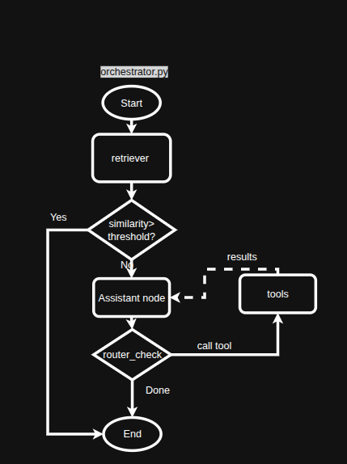

**GAIA Agent - Advanced Q&A Chatbot**

# 🌟 **Introduction**

**GAIA Agent** is a sophisticated AI-powered chatbot system designed to handle complex questions and tasks through an intuitive Q&A interface. Built on top of the GAIA benchmark framework, this agent combines advanced reasoning, code execution, web search, document processing, and multimodal understanding capabilities. The system features both a user-friendly chatbot interface and a comprehensive evaluation runner for benchmark testing.


# **Key Features**

- **🔍 Multi-Modal Search**: Web search, Wikipedia, and arXiv paper search
- **💻 Code Execution**: Support for Python, Bash, SQL, C, and Java
- **🖼️ Image Processing**: Analysis, transformation, OCR, and generation
- **📄 Document Processing**: PDF, CSV, Excel, and text file analysis
- **📁 File Upload Support**: Handle multiple file types with drag-and-drop
- **🧮 Mathematical Operations**: Complete set of mathematical tools
- **💬 Conversational Interface**: Natural chat-based interaction
- **📊 Evaluation System**: Automated benchmark testing and submission


**Project Structure**
GAIA_agent

|-----agent
| 				|----__init__.py
| 				|----agent.py
|
|-----tools
| 				|----__init__.py
| 				|----Search.py
| 				|----code_interpreter.py
| 				|----Mathenmatical.py
| 				|----document_proccesing.py
| 				|----image_generate.py
|				|----mathematical.py
|
|-----data
| 				|----explore_metadata.ipynb
| 				|----metadata.jsonl
|
|-----app.py
|-----requirements.txt
|-----system_prompt.txt


# 🔧 **Technical Architecture**

### **LangGraph State Machine**




1. **Retriever Node**: Searches vector database for similar questions
2. **Assistant Node**: LLM processes question with available tools
3. **Tools Node**: Executes selected tools (web search, code, etc.)
4. **Conditional Routing**: Dynamically routes between assistant and tools

### **Vector Database Integration**
- **Supabase Vector Store**: Stores GAIA benchmark Q&A pairs
- **Semantic Search**: Finds similar questions for context
- **HuggingFace Embeddings**: sentence-transformers/all-mpnet-base-v2

### **Multi-Modal File Support**
- **Images**: JPG, PNG, GIF, BMP, WebP
- **Documents**: PDF, DOC, DOCX, TXT, MD
- **Data**: CSV, Excel, JSON
- **Code**: Python, Bash, SQL, C, Java


# **Tool Categories**

### **🌐 Browser & Search Tools**
- **Wikipedia Search**: Search Wikipedia with up to 2 results
- **Web Search**: Tavily-powered web search with up to 3 results  
- **arXiv Search**: Academic paper search with up to 3 results

### **💻 Code Interpreter Tools**
- **Multi-Language Execution**: Python, Bash, SQL, C, Java support
- **Plot Generation**: Matplotlib visualization support
- **DataFrame Analysis**: Pandas data processing
- **Error Handling**: Comprehensive error reporting

### **🧮 Mathematical Tools**
- **Basic Operations**: Add, subtract, multiply, divide
- **Advanced Functions**: Modulus, power, square root
- **Complex Numbers**: Support for complex number operations

### **📄 Document Processing Tools**
- **File Operations**: Save, read, and download files
- **CSV Analysis**: Pandas-based data analysis
- **Excel Processing**: Excel file analysis and processing
- **OCR**: Extract text from images using Tesseract

### **🖼️ Image Processing & Generation Tools**
- **Image Analysis**: Size, color, and property analysis
- **Transformations**: Resize, rotate, crop, flip, adjust brightness/contrast
- **Drawing Tools**: Add shapes, text, and annotations
- **Image Generation**: Create gradients, noise patterns, and simple graphics
- **Image Combination**: Stack and combine multiple images


# 🎯 **How to Use**


## ⚙️ **Installation & Setup**

### **1. Clone Repository**
```bash

git clone git@github.com:datt46999/GAIA_Agent.git
cd gaia-agent
```

### **2. Install Dependencies**
```bash
pip install -r requirements.txt
```

### **3. Environment Variables**

<!-- SUPABASE_URL=https://xxxxxxxxxxxxxxxxxxxxx.supabase.co --> 

Create a `.env` file with your API keys:
```
SUPABASE_URL=your_supabase_url
SUPABASE_SERVICE_ROLE_KEY=your_supabase_key
GROQ_API_KEY=your_groq_api_key
OPENAI_API_KEY=your_openai_api_key
TAVILY_API_KEY=your_tavily_api_key
HUGGINGFACEHUB_API_TOKEN=your_hf_token
LANGSMITH_API_KEY=your_langsmith_key


LANGSMITH_TRACING=true
LANGCHAIN_TRACING_V2=false

LANGSMITH_PROJECT=model_agent
LANGSMITH_ENDPOINT=https://api.smith.langchain.com
```
### **4. Database Setup (Supabase)**
Execute this SQL in your Supabase database:
```sql
-- 1. Enable pgvector
CREATE EXTENSION IF NOT EXISTS vector;

-- 2. Create the table FIRST (function depends on it)
CREATE TABLE public.documents2 (
  id        bigserial PRIMARY KEY,
  content   text,
  metadata  jsonb,
  embedding vector(768)
);

-- 3. Create the match function
CREATE OR REPLACE FUNCTION public.match_documents_2(
  query_embedding vector(768)
)
RETURNS TABLE(
  id        bigint,
  content   text,
  metadata  jsonb,
  embedding vector(768),
  similarity double precision
)
LANGUAGE sql STABLE
AS $$
  SELECT
    id,
    content,
    metadata,
    embedding,
    1 - (embedding <=> query_embedding) AS similarity
  FROM public.documents2
  ORDER BY embedding <=> query_embedding
  LIMIT 10;
$$;

-- 4. Grant permissions
GRANT EXECUTE ON FUNCTION public.match_documents_2(vector) TO anon, authenticated;

-- 5. Disable RLS (prevents the 42501 insert error)
ALTER TABLE public.documents2 DISABLE ROW LEVEL SECURITY;

```


## 🚀 **Running the Application**

### **Run**
```bash
python app.py
```
Access at: `http://localhost:7860`

## 🔗 **Resources**

- [GAIA Benchmark](https://huggingface.co/spaces/gaia-benchmark/leaderboard)
- [Hugging Face Agents Course](https://huggingface.co/agents-course)
- [LangGraph Documentation](https://langchain-ai.github.io/langgraph/)
- [Supabase Vector Store](https://supabase.com/docs/guides/ai/vector-columns)

